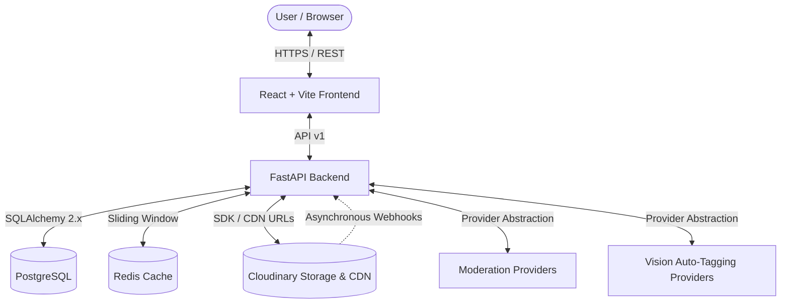

# Claudinary AI Platform Architecture

## 1. System Overview

Claudinary is a modular, production-ready AI-powered image asset management platform designed to be publicly deployable. It pairs a **FastAPI** Python backend with a high-performance **React / Vite / TypeScript** frontend, using **Cloudinary** for edge media storage, transformations, and CDNs, **PostgreSQL** for catalog metadata, and **Redis** for rate limiting.

---

## 2. Key Architectural Tenets

1. **Modular Monolith**:
   All core concerns are cleanly organized in one cohesive service without premature microservice fragmentation or distributed complexity.
2. **Provider Abstraction**:
   - **ModerationProvider**: Allows switching between `ManualModerationProvider`, `AWS Rekognition`, or `WebPurify` without changing DB models or API routes.
   - **VisionProvider**: Abstracts object and scene detection (currently implemented via Cloudinary AI / Google Tagging, with full capability for Google Cloud Vision or AWS).
3. **No Direct Secret Leakage**:
   - The browser never contacts PostgreSQL or Redis directly.
   - Cloudinary API Secret and Admin API Key are strictly isolated in backend environment variables.
   - On-demand transformations leverage dynamic CDN transformation URLs without saving redundant file duplicates.
4. **Resilient Upload Pipeline**:
   - 10 MB strict file size ceiling.
   - File signature / magic byte inspection prevents client-reported MIME forgery.
   - Rate limit (20 uploads/minute) protected via sliding-window Redis counter with in-memory fallback.
   - Uploaded binaries reside only ephemerally in RAM before streaming to storage; zero permanent files on app servers.

---

## 3. Data Lifecycle & States

### Asset Lifecycle:
- `PROCESSING`: Binary uploaded, background AI tasks running.
- `PENDING`: Awaiting administrator review (publicly invisible).
- `APPROVED`: Fully active and publicly visible in the catalog.
- `REJECTED`: Hidden from public catalog with recorded reason.
- `FAILED`: Unrecoverable processing or upload failure.

### Moderation Lifecycle:
- `PENDING` -> `APPROVED` | `REJECTED`

---

## 4. Subject-Aware Presets & Transformations

Cloudinary's `g_auto` (subject-aware gravity) is used to generate preset derivative dimensions:
- **thumbnail**: 300 × 300 (`c_fill, g_auto, f_auto, q_auto`)
- **square**: 1080 × 1080 (`c_fill, g_auto, f_auto, q_auto`)
- **landscape**: 1600 × 900 (`c_fill, g_auto, f_auto, q_auto`)
- **portrait**: 1080 × 1350 (`c_fill, g_auto, f_auto, q_auto`)

Dynamic transformations support on-demand background removal (`e_background_removal`), custom widths, heights, and crop algorithms.

---

## 5. Webhook Handling

Cloudinary events (categorization, moderation, upload notifications) are received at:
`POST /api/v1/webhooks/cloudinary`
- Cryptographic signature validation with timestamp checks (`X-Cld-Signature`, `X-Cld-Timestamp`).
- Idempotent state reconciliation ensures duplicate deliveries are handled safely.
